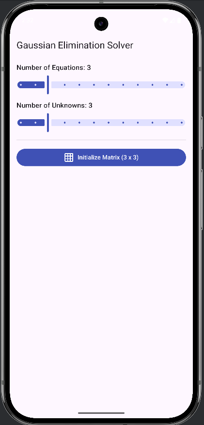
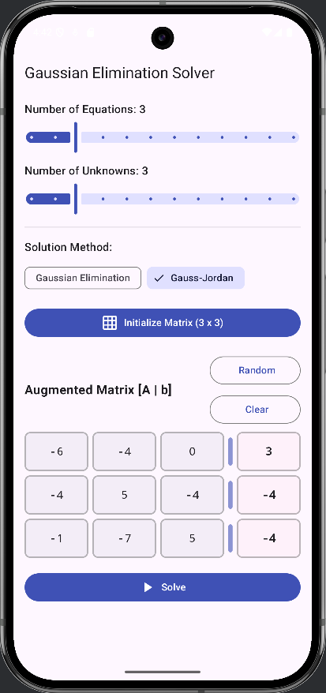
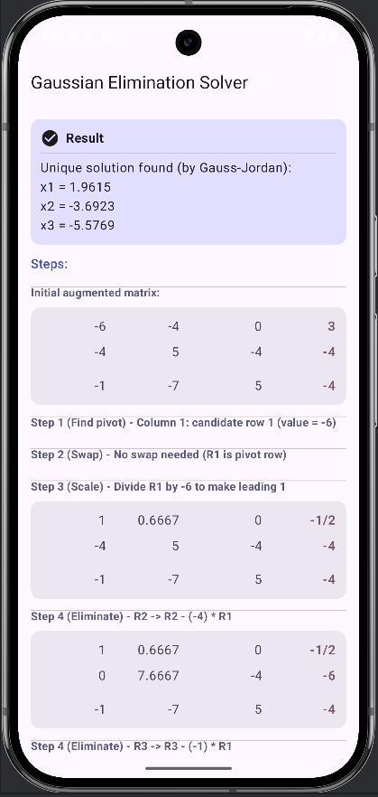

# 🧮 Gaussian Elimination Solver

An Android app built with **Jetpack Compose (Material 3)** that solves systems of linear equations using the **Gaussian Elimination** method.

## 📘 Overview
- Enter the number of equations and the augmented matrix.  
- The app performs elimination and shows each step clearly.  
- Displays all operations (e.g., `R2 → R2 - 2*R1`) and the final solution.  
- Built with **MVVM architecture** for clean separation between logic and UI.

## 🧠 Tech
**Language:** Kotlin  
**Framework:** Jetpack Compose  
**Architecture:** MVVM  

## 🚀 Run
1. Open in Android Studio  
2. Sync Gradle  
3. Run on emulator or device

## 📷 Screenshots

| Gaussian | Gaus-Jordan | Final Result |
|---------------|----------------|----------------|
|  |  |  |

## 👨‍💻 Developer
**Mohamed Samy Elboraey**  
Faculty of Computers & Information – Mansoura University

---
